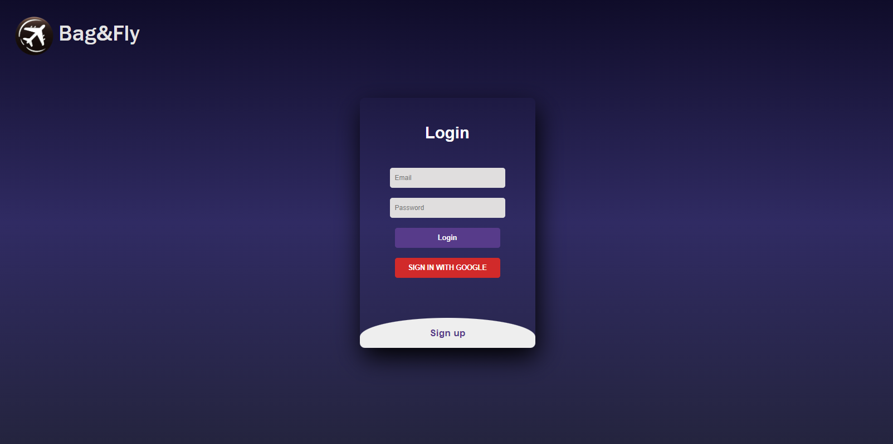
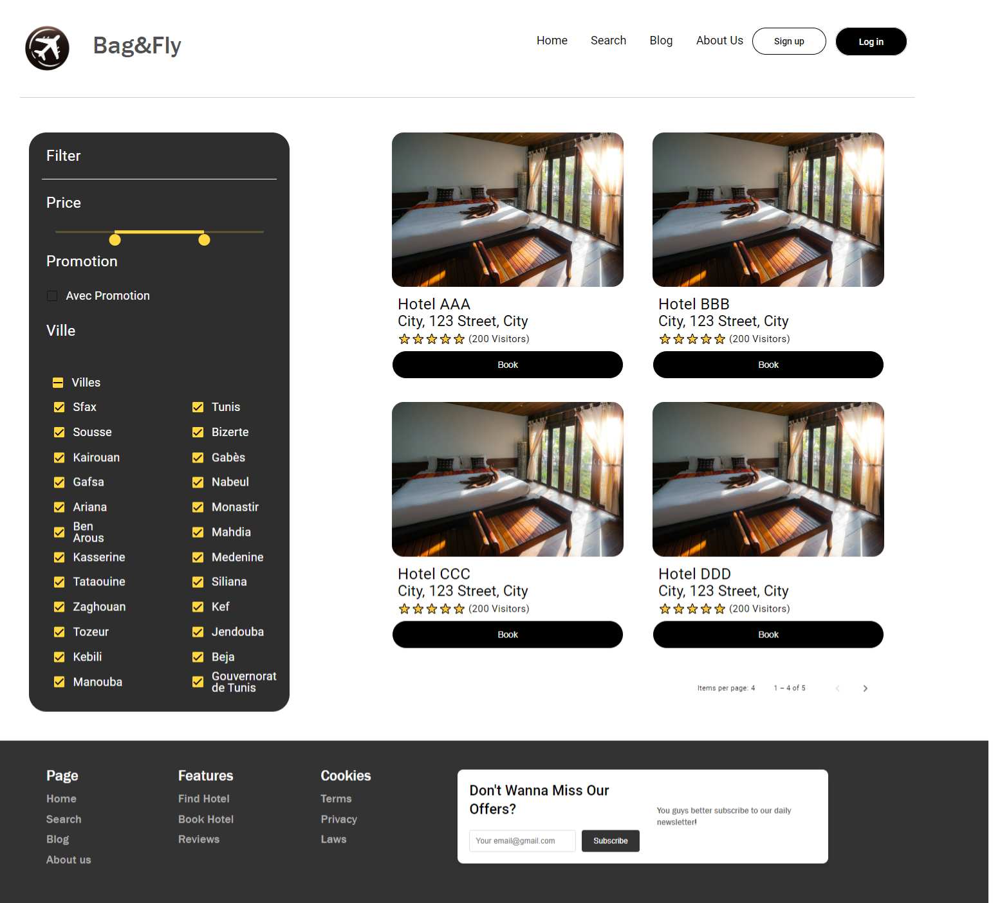
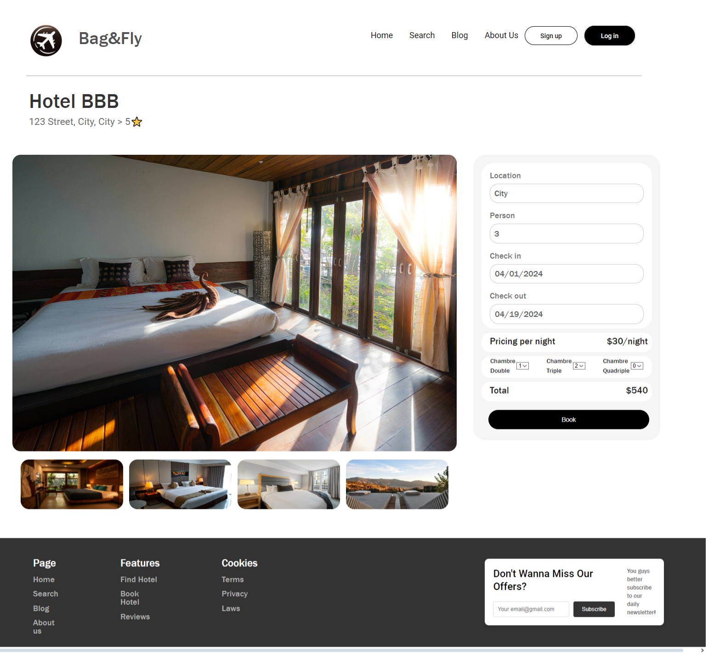

# Bag&Fly Project

Welcome to the **Bag&Fly** project repository! This project integrates **Angular** for the frontend and **Laravel** for the backend, offering a robust and dynamic web application.

## 🗂️ Project Structure

```
/Bag&Fly_Repository
  /Bag&Fly_Angular  # Angular frontend
  /Bag&Fly_Laravel  # Laravel backend
  /.gitignore        # Git ignore rules
  /README.md         # This file
```

## 🚀 Technologies Used

- **Laravel**: Powerful backend framework for building scalable server-side applications.
- **Angular**: Modern frontend framework for creating interactive and responsive user interfaces.

## 📦 Setup Instructions

1. **Clone the Repository**

   ```bash
   git clone https://github.com/yourusername/Bag&Fly_Project.git
   cd Bag&Fly_Project
   ```

2. **Install Dependencies**

   **Laravel**:
   ```bash
   cd Bag&Fly_Laravel
   composer install
   ```

   **Angular**:
   ```bash
   cd ../Bag&Fly_Angular
   npm install
   ```

3. **Set Up Environment Variables**

   **Laravel**:
   - Copy `.env.example` to `.env` and configure as needed:
     ```bash
     cp .env.example .env
     php artisan key:generate
     ```

   **Angular**:
   - Configure `.env` if applicable.

4. **Run the Applications**

   **Laravel**:
   ```bash
   php artisan serve
   ```

   **Angular**:
   ```bash
   ng serve
   ```

## 🌟 Features

- **Backend**: API management, authentication, and data handling with Laravel.
- **Frontend**: Dynamic and interactive user interface with Angular.

## 📄 License

This project is licensed under the [MIT License](LICENSE).

## 🖼️ Website UI







